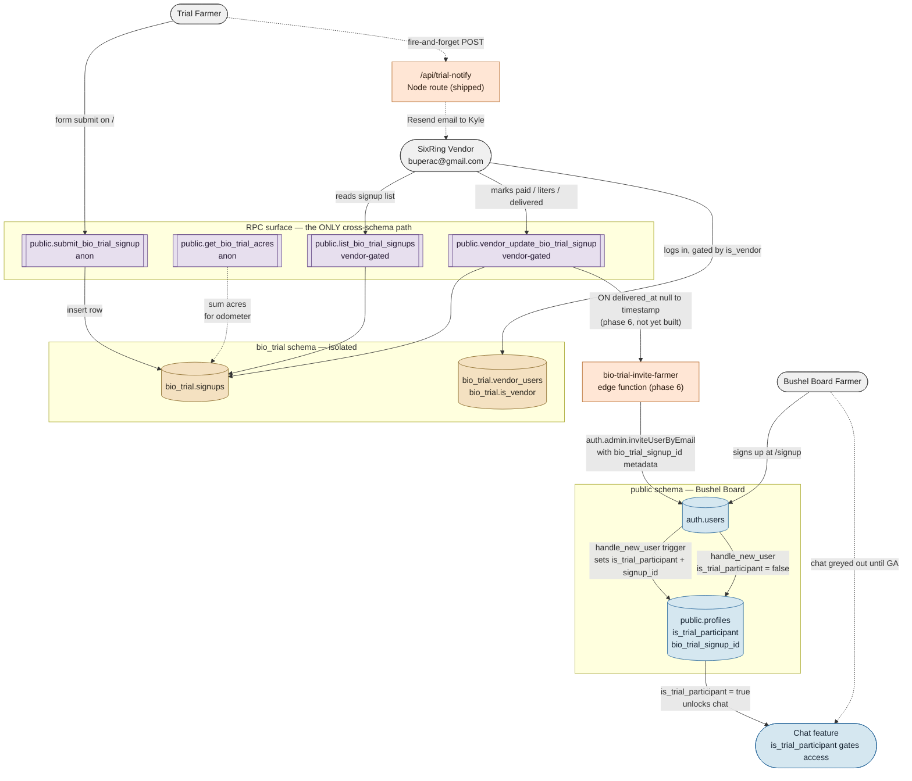

# Bio Trial — Feature Status & Architecture

> **⚠️ DEPRECATED 2026-04-28.** This handover is historical. The bio-trial signup feature was retired with the Prairie Landing Page when the auth model flipped to public-by-default (STATUS Tracks 47 + 13 + 45). All code paths described below have been deleted. The Supabase RPCs are dormant. The seasonal-trial revival mentioned below would now have to be rebuilt against whatever public surface replaces the landing page. **Do not treat the architecture below as current.**

**Date:** 2026-04-18 (evening)
**Owner context:** 2026 Buperac × SixRing foliar biostimulant trial. Seasonal feature — expected to reactivate annually when new trials open.
**Branch:** `feature/bio-trial-integration` (see [Branch strategy](#branch-strategy)).

---

## Why this doc exists

Two things were in motion in parallel and need to be reconciled so the next session (and next year's trial) has a single source of truth:

1. **On Bushel Board** (master, uncommitted): Phases 1–3 of [`docs/plans/2026-04-18-bio-trial-integration-design.md`](../plans/2026-04-18-bio-trial-integration-design.md) — GA4, the design doc itself, and the homepage trial section + notify email. Already recorded as **Track 45** in [`docs/plans/STATUS.md`](../plans/STATUS.md).
2. **On the standalone `bio_trial/` site**: a SixRing vendor console (`vendor.html` + `vendor.js`) that implements what Phase 4 of the design doc proposed to do inside Bushel Board at `/admin`. Plus landing-page polish (hero padding, copy tweak, odometer bug fix, SixRing login pill, top-right login link).

These two lines need to converge. The intent is that **Bushel Board becomes the single app** (per the design doc); the standalone site survives as a fallback while we bring the vendor console across.

---

## Two farmer journeys, one schema boundary

> **Rule:** trial farmers and Bushel Board farmers live in different tables until a vendor explicitly marks a trial shipment **delivered**. No auto-promotion. No cross-writes. The only bridge is a whitelisted set of `SECURITY DEFINER` RPCs in `public`.



---

## How contamination is prevented

| Risk | Safeguard |
|---|---|
| App code writes directly to `bio_trial.signups` and bypasses price/status rules | Schema isolation — app code can only reach `bio_trial.*` via the four whitelisted `public.*` RPCs, all `SECURITY DEFINER`. Direct table grants to `anon` / `authenticated` are revoked. |
| A signup auto-creates a `profiles` row before payment/delivery | Promotion is **vendor-triggered**. Only `vendor_update_bio_trial_signup` flipping `product_delivered_at` fires the invite. Signups without delivery stay in `bio_trial.*` forever. |
| Regular Bushel Board users accidentally flagged `is_trial_participant = true` | Flag is only set by `handle_new_user()` when the invite metadata contains `bio_trial_signup_id`. Normal `/signup` flow never supplies that metadata. |
| A random authenticated user reads all signups | `list_bio_trial_signups` and `vendor_update_bio_trial_signup` open with `IF NOT bio_trial.is_vendor() THEN RAISE EXCEPTION 'not authorised'` before any table access. |
| A farmer's email in `bio_trial.signups` is duplicated in `auth.users` | One-way mapping: `profiles.bio_trial_signup_id` points back at the signup, but `signups.promoted_user_id` (reserved column) is the forward pointer. No joins in hot paths. Dashboard queries never reach across. |
| Styles, components, or client state from the trial bleed into the rest of the app | `components/landing/trial-desk.css` is scoped under `.trial-desk`. All trial React components live in `components/landing/trial-*`. The only non-landing touch points are `lib/supabase/middleware.ts` (one `startsWith` exemption for `/api/trial-notify`) and the standalone site at `bio_trial/`. |

---

## What's done (as of 2026-04-18 evening)

### ✅ Phase 1 — GA4 instrumentation
- [components/analytics/google-analytics.tsx](../../components/analytics/google-analytics.tsx), mounted in [app/layout.tsx](../../app/layout.tsx).
- `trackEvent("trial_signup", { acres, logistics_method, crops })` fires on successful submit.
- Gated on `NEXT_PUBLIC_GA_MEASUREMENT_ID` — unset → noop.

### ✅ Phase 2 — Design doc
- [docs/plans/2026-04-18-bio-trial-integration-design.md](../plans/2026-04-18-bio-trial-integration-design.md).

### ✅ Phase 3 — Landing-page trial section + notify email
- **Live on `/`** (inside `<LandingPage>`, below the PrairieScene hero): `<TrialDeskSection>` → `<TrialForm>` + `<TrialOdometer>`.
- **Submit path:** browser → `public.submit_bio_trial_signup` via anon Supabase client → row in `bio_trial.signups` → `APPROVED` stamp + odometer roll. Fire-and-forget `POST /api/trial-notify` → Resend email to `kyle@bushelsenergy.com`.
- **Reference doc** (critical invariants, failure modes, env vars): [docs/reference/bio-trial-signup.md](../reference/bio-trial-signup.md).
- **STATUS entry:** Track 45 in [docs/plans/STATUS.md](../plans/STATUS.md).

### 🟡 Phase 3.5 — Standalone-site polish (this session, on `bio_trial/`)
Not part of the Bushel Board plan, but real work that exists and needs to be accounted for:
- Landing: hero top padding tightened, `"Try our biostimulant. / On your fields."` copy, SixRing login pill top-right, odometer bug fixed ([app.js:94](../../../bio_trial/app.js:94) — the drums array holds `{drum, strip, current}` not DOM nodes).
- Vendor console: [vendor.html](../../../bio_trial/vendor.html) + [vendor.js](../../../bio_trial/vendor.js). Logs in at `/vendor`, calls `bio_trial_list_signups` + `bio_trial_vendor_update` RPCs (note: these were created with `bio_trial_`-prefixed names this session; the design doc planned `list_bio_trial_signups` / `vendor_update_bio_trial_signup`. Both variants exist in the DB. **See [Migration note](#migration-note-rpc-naming).**)
- DB: `bio_trial.vendor_users` now has a row mapping `buperac@gmail.com`'s auth.users UUID to vendor_name `"SixRing"`.

### ⬜ Phase 4 — Bushel Board `/admin` vendor console
Planned but not started. The standalone site's `vendor.html` is the current stand-in. To ship Phase 4 we port the same UI into a Next.js route group at `app/(admin)/admin/page.tsx`, reusing the same RPCs.

### ⬜ Phase 5 — Trial-member flag + chat gating
Not started. Requires:
- `profiles.is_trial_participant boolean` + `profiles.bio_trial_signup_id uuid references bio_trial.signups(id)` migration.
- `handle_new_user()` trigger update to copy `bio_trial_signup_id` from user metadata.
- Navigation gate: chat entry `opacity-50 pointer-events-none` + tooltip when `!is_trial_participant`.

### ⬜ Phase 6 — Delivery → magic-link invite
Not started. `public.vendor_update_bio_trial_signup` detects `product_delivered_at` null→timestamp transition and fires an edge function that calls `auth.admin.inviteUserByEmail()` with `bio_trial_signup_id` in metadata.

### ⬜ Phase 7 — Trial tab with auto-imported farmer data
> This is **new**, beyond the original design doc — added 2026-04-18 per Kyle's ask.

Add a "Trial" tab in the trial-participant dashboard that shows:
- That farmer's own trial status (applied yet, observations logged, where they sit in the cohort).
- Aggregate cohort view for Kyle + SixRing: how far along each participant is, what the biostimulant is doing across farms.

**Data source:** chat conversations. Trial participants use the chat feature to log applications ("sprayed 40ac canola today"), observations ("leaf tip chlorosis on the north quarter"), and answer check-in prompts from Bushy. Structured extraction turns those messages into trial-event rows.

**New schema sketch** (needs its own design doc — this is a spine, not a spec):
```sql
-- one row per farmer per trial (future-proof for annual cohorts)
create table bio_trial.trial_participations (
  id uuid primary key default gen_random_uuid(),
  signup_id uuid references bio_trial.signups(id),
  user_id uuid references auth.users(id),
  cohort_year int not null,              -- 2026, 2027, ...
  enrolled_at timestamptz default now(),
  status text default 'active'           -- active | completed | withdrew
);

-- structured events extracted from chat OR entered by Kyle/SixRing
create table bio_trial.trial_events (
  id uuid primary key default gen_random_uuid(),
  participation_id uuid references bio_trial.trial_participations(id),
  event_type text not null,              -- application | observation | yield | note
  event_at timestamptz not null,         -- when the thing happened on-farm
  source text not null,                  -- chat | vendor | manual
  chat_message_id uuid,                  -- FK to chat_messages when source='chat'
  payload jsonb not null                 -- rate_l_per_acre, crop, acres, notes, photos, etc.
);
```

**Chat-side wiring** (high-level, not yet designed):
- Bushy's system prompt gains a branch for trial participants: "when a user describes a field application or observation, extract structured data and confirm with the user before logging."
- A new chat tool `log_trial_event(event_type, event_at, payload)` writes into `bio_trial.trial_events`. Tool is only exposed when `is_trial_participant = true`.
- The Trial tab reads aggregates via a new RPC `public.get_trial_cohort_progress(cohort_year int)`.

---

## Migration note — RPC naming

Two families of RPC names exist in the Supabase project right now:

| Name (this-session convention) | Name (design-doc convention) | Status |
|---|---|---|
| `bio_trial_list_signups()` | `list_bio_trial_signups()` | `bio_trial_list_signups` **created this session**; the design-doc variant isn't applied yet. |
| `bio_trial_vendor_update(p_signup_id, p_paid, p_liters, p_delivered, p_notes)` | `vendor_update_bio_trial_signup(id, patch jsonb)` | `bio_trial_vendor_update` **created this session** with positional params; the design-doc variant uses a jsonb `patch`. Not applied. |

**Decision needed:** pick one naming + signature and drop the other. The standalone `vendor.js` and the planned `/admin` UI both need to agree. Recommend keeping the **design-doc names with `jsonb patch`** — more flexible for future whitelist additions — and renaming the ones we created this session. Cheap: they're called from exactly one place right now.

---

## Branch strategy

- Branch name: **`feature/bio-trial-integration`** (created from `master` at current HEAD).
- Lifecycle: long-lived seasonal feature branch. Merge into `master` to activate a trial season; revert/trim once the season closes. Same pattern Prairie team has used for `feature/prairie-landing-page`.
- What lives on this branch:
  - `app/api/trial-notify/` route + middleware exemption
  - `components/landing/trial-*.{ts,tsx,css}` (6 files)
  - `components/analytics/` (GA4 — arguably platform-wide, but added specifically for the trial; keep here unless another feature starts using it)
  - `docs/plans/2026-04-18-bio-trial-integration-design.md`
  - `docs/reference/bio-trial-signup.md`
  - `docs/handovers/2026-04-18-bio-trial-feature-status.md` (this doc)
  - Phase 4–7 additions as they land (`/admin` route, `is_trial_participant` migrations, invite edge function, Trial tab, chat tool wiring)
- What does NOT live on this branch: the US desk swarm work, pipeline scripts, agent definitions, or any other in-flight work currently uncommitted on `master`. Those get their own commits/branches.

> **Open item:** the uncommitted files on `master` currently include both trial work and unrelated in-flight work. A clean split is needed before the first commit on `feature/bio-trial-integration`. Proposed approach in the next section.

---

## Next steps

Ordered by dependency, not priority:

1. **Reconcile RPC naming** (DB migration) — pick one set, drop the other. See [Migration note](#migration-note-rpc-naming).
2. **Commit Phase 1–3 work** to `feature/bio-trial-integration`. List of files is in [Branch strategy](#branch-strategy). Non-trial uncommitted files on master stay where they are.
3. **Port the standalone vendor console to `/admin`** (Phase 4). Single Next.js page, same RPCs, replaces [bio_trial/vendor.html](../../../bio_trial/vendor.html).
4. **Ship Phase 5** — `profiles.is_trial_participant` column + `handle_new_user()` trigger update + chat nav gate.
5. **Ship Phase 6** — delivery trigger fires invite edge function; verified against a real email in sandbox mode.
6. **Design Phase 7** — the Trial tab + `log_trial_event` chat tool. Separate design doc. Needs Kyle + SixRing alignment on which events to track structured (applications, observations, yield) vs. free-form.
7. **Retire standalone `bio_trial/` deploy** (Phase 7 of the original doc, now Phase 8 given the Trial tab reshuffle) — pause the Vercel project, add a note in [bio_trial/README.md](../../../bio_trial/README.md).

---

## Cross-references

- Source design: [docs/plans/2026-04-18-bio-trial-integration-design.md](../plans/2026-04-18-bio-trial-integration-design.md)
- Shipped-state reference: [docs/reference/bio-trial-signup.md](../reference/bio-trial-signup.md)
- Feature tracker: [docs/plans/STATUS.md](../plans/STATUS.md) (Track 45)
- Standalone site: [bio_trial/README.md](../../../bio_trial/README.md)
