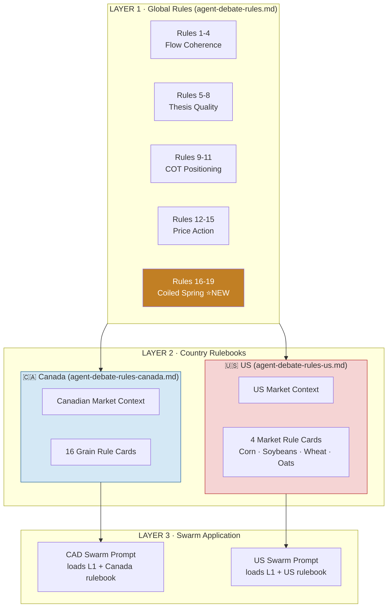

# Regional Grain Rules & Unified Tier-Based Debate — Design

**Date:** 2026-04-18
**Status:** Design approved; implementation plan pending (writing-plans skill)
**Author:** Brainstormed with Kyle, validated by risk-analyst agent (Coiled Spring evaluation)

---

## Problem

The existing `docs/reference/agent-debate-rules.md` has 15 global rules and grain-specific notes for only 4 of 16 Canadian grains (Canola, Oats, Peas, Barley). The US desk has no dedicated rulebook. Every rule implicitly assumes Canadian market context — Vancouver ports, ICE Canola basis, Saskatchewan elevators, CGC data cadence. When the US swarm was added, those implicit assumptions became drift risk: a rule that says "check the vessel queue" doesn't translate cleanly to Iowa river terminals.

Separately, the recent Coiled Spring evaluation (risk-analyst output, 2026-04-18) proved that a physical-tightness framework applies cleanly to 7 specific Canadian grains (canola, lentils, peas, amber durum, mustard seed, canaryseed, flaxseed) but misfires when applied uniformly. We need a way to codify "which rules apply to which grain in which country" and make those rules *injectable* into the right swarm at the right step.

Finally, the Friday Desk currently produces a per-grain `stance_score` but does not rank grains against each other. Farmers and operators reading the desk output have to eyeball which grain is the strongest opportunity this week. A unified bull→bear ranking across all North American markets (Canadian + US) is the missing output.

## Goals

1. Split the implicit global-only ruleset into three layers: **global rules** (country-agnostic), **country rules** (CAD, US), and **grain-specific rule cards** (20 total: 16 CAD + 4 US).
2. Introduce a **rule-ID citation convention** (`R-16`, `R-CA-CNL-03`, `R-US-COR-02`) so specialists and the desk chief cite rules as evidence, and the meta-reviewer can audit coverage.
3. Add a **tier-based debate phase** (Strong Bull / Mild Bull / Neutral / Mild Bear / Strong Bear) and **intra-tier ranking** using the Compression Index from the Coiled Spring work.
4. Produce a **unified North American ranked list** on Friday nights, with cross-border competition visible (e.g., CAD Canola vs US Corn for the top spot).
5. Do this without over-engineering: markdown files, not a registry. v1 can be shipped in one week.

## Non-goals

- Sub-regional rules (Prairie vs Ontario, Midwest vs PNW). Deferred to v2.
- US wheat class expansion (HRW/SRW/HRS/SWW). v1 treats US Wheat as one market. Deferred to v2.
- Empirically calibrated tier thresholds. v1 ships with eyeballed bands; meta-reviewer recalibrates after 2 weeks of live data.
- Dashboard UI polish. Deferred to a later phase using the `frontend-design` skill.
- YAML rule registry / programmatic rule access. Considered and rejected (YAGNI for v1).

## Architecture

### Rule Layer Stack



### Rule Numbering Convention

| Rule type            | Format                    | Example                                  |
|----------------------|---------------------------|------------------------------------------|
| Global rule          | `R-NN`                    | `R-16` (Coiled Spring — receipts condition) |
| Canadian grain rule  | `R-CA-<GRAIN>-NN`         | `R-CA-CNL-03` (Canola, vessel queue)     |
| US market rule       | `R-US-<MARKET>-NN`        | `R-US-COR-02` (US Corn, ethanol pace)    |

Grain codes for Canada: CNL (Canola), WHT (Wheat), DUR (Amber Durum), OAT (Oats), BAR (Barley), PEA (Peas), LEN (Lentils), CHK (Chick Peas), MST (Mustard Seed), FLX (Flaxseed), CNR (Canaryseed), RYE (Rye), COR (Corn), SOY (Soybeans), SUN (Sunflower), BEA (Beans).

US market codes: COR (Corn), SOY (Soybeans), WHT (Wheat), OAT (Oats).

### File Layout

```
docs/reference/
├── agent-debate-rules.md                  (existing; expanded from 15 → 19 rules)
├── agent-debate-rules-canada.md           (NEW — 16 grain cards + CAD context)
└── agent-debate-rules-us.md               (NEW — 4 market cards + US context)
```

### New Global Rules 16-19 (Coiled Spring Disambiguators)

Added to the Price Action section of `agent-debate-rules.md`:

- **R-16 · Pipeline Congestion Requires Receipt Confirmation** — Pipeline tension (vessel queue, OCT, terminal fill) scores bullish ONLY if terminal receipts simultaneously accelerate. Otherwise congestion may be supply-side (rail failure, labor) which is bearish for basis.
- **R-17 · Elevator-vs-Crush Bid Spread Disambiguates "Withholding"** — If Process deliveries are rising while Primary deliveries fall, farmers are migrating to better-bidding crushers, not withholding. The spring is real but its release vector is basis, not futures.
- **R-18 · Basis Veto Rule** — If the basis component of any composite index scores -2 or worse, cap the composite at +2 regardless of other signals. Basis is the farmer's truth (Rule 12) and cannot be overridden by fundamentals.
- **R-19 · COT Short-Cover Requires 3-Week or Shipment Confirmation** — One week of commercial short-cover is ambiguous between sales completion (bearish) and directional capitulation (bullish). Confirm via either (a) 3 weeks of same-direction moves, or (b) cross-check against USDA export shipments for that week.

## Data Flow

```mermaid
flowchart TB
    subgraph P1["PHASE 1 · Data Collection (Haiku scouts)"]
        direction LR
        S1[supply-scout]
        S2[demand-scout]
        S3[basis-scout]
        S4[sentiment-scout]
        S5[logistics-scout]
        S6[macro-scout]
    end

    subgraph INJ["🔑 RULE INJECTION"]
        direction LR
        GR["Global Rules<br/>R-1 to R-19"]
        CR["Country Rules<br/>CAD or US context"]
        GRN["Grain Rule Card<br/>per target grain"]
    end

    subgraph P2["PHASE 2 · Per-Grain Synthesis (Sonnet specialists, rules applied)"]
        direction LR
        SP1[export-analyst]
        SP2[domestic-analyst]
        SP3[price-analyst]
        SP4[risk-analyst]
    end

    SCORE["PHASE 3 · Stance Scoring<br/>stance_score + Compression Index (Opus)"]

    subgraph P4["PHASE 4 · Tier Assignment"]
        direction LR
        SB["🟢 Strong Bull<br/>score > +50"]
        MB["🟢 Mild Bull<br/>+20 to +50"]
        NT["⚪ Neutral<br/>-20 to +20"]
        MBR["🔴 Mild Bear<br/>-50 to -20"]
        SBR["🔴 Strong Bear<br/>score < -50"]
    end

    RANK["PHASE 5 · Intra-Tier Debate<br/>Compression Index → grain-specific tiebreakers"]

    UNIFY["PHASE 6 · Unifier<br/>Merge CAD + US ranked lists into<br/>North American unified ranking"]

    AUDIT["PHASE 7 · Meta-Review (Opus)<br/>rule coverage · evidence chain · calibration"]
    OUT["🏁 Unified Ranked List<br/>Bullish → Bearish<br/>with Rule Citations"]

    P1 --> INJ
    INJ --> P2
    P2 --> SCORE
    SCORE --> P4
    P4 --> RANK
    RANK --> UNIFY
    UNIFY --> AUDIT
    AUDIT --> OUT

    style INJ fill:#fff4e0,stroke:#c17f24,stroke-width:3px
    style SCORE fill:#e8f5d4,stroke:#437a22
    style RANK fill:#e8f5d4,stroke:#437a22
    style UNIFY fill:#e0f0f5,stroke:#2e6b9e,stroke-width:2px
    style OUT fill:#c17f24,color:#fff
```



### Rule Injection Points

1. **Scouts → Specialists:** Each specialist's prompt receives `global rules + country context + target grain's rule card`. Specialists cite rule IDs as evidence in their synthesis output.
2. **Specialists → Desk Chief:** Desk chief receives all specialist briefs plus the full rulebook and produces `stance_score` and Compression Index class per grain.
3. **Desk Chief self-debate (Phase 4→5):** Two-pass. Phase 4 buckets grains into 5 tiers by `stance_score`. Phase 5 ranks within each tier using Compression Index primary key, grain-specific tiebreakers as fallback.
4. **Unifier phase (NEW):** After both CAD and US swarms complete, a unifier step merges their ranked outputs into a single North American ranking. This is the only new orchestration step required; both swarms continue to produce their country-scoped outputs independently as today.
5. **Meta-review:** Opus audits rule coverage (did every grain cite at least one grain-specific rule?), evidence chain, and calibration.

### Unifier Mechanics

The unifier runs after both Friday swarms complete (CAD 6:47 PM ET, US 7:30 PM ET). It is a single Opus call that:
- Reads `market_analysis` rows for the current week (CAD)
- Reads `us_market_analysis` rows for the current week (US)
- Applies the same tier thresholds globally (>+50 Strong Bull, etc.)
- Ranks across 20 entries (16 CAD + 4 US)
- Writes to a new table `unified_rankings` with columns: `week_ending, region, grain, tier, rank_overall, stance_score, compression_index, compression_class, primary_driver, rule_citations[], thesis_killer_watch, created_at`

Overlap handling: CAD Wheat and US Wheat are ranked as separate entries (different markets, different drivers, different farmer audiences). Same for Corn, Soybeans, Oats. This gives 20 unique rows per week.

## Grain Rule Card Template

Every grain (16 CAD + 4 US = 20) uses the same card structure:

```markdown
## 🌱 Canola (Canada)

**Compression Index Class:** A (all 5 components valid)
**Coiled Spring Fit:** STRONG
**Typical Stance Range:** -40 to +80

### Market Structure Fingerprint
| Dimension            | Value                                            |
|----------------------|--------------------------------------------------|
| Canada world share   | ~75% of seed trade                               |
| Futures              | ICE Canola (Winnipeg) — liquid                   |
| Key buyers           | China (40%), Japan, UAE, Mexico                  |
| Domestic crush       | ~55% of supply                                   |
| Primary export port  | Vancouver (95%+)                                 |
| Rail constraint      | Demand-pull sensitive                            |

### Grain-Specific Rules
- **R-CA-CNL-01 · Crush dominates.** ~55% of demand. Never analyze exports alone.
- **R-CA-CNL-02 · China tariff lag.** Policy moves take 2-4 weeks to appear in CGC data.
- **R-CA-CNL-03 · Vancouver vessel queue is the canola bottleneck.**
- **R-CA-CNL-04 · Primary/Process delivery split is a basis tell.**
- **R-CA-CNL-05 · Compression Index Class A.** All 5 components apply.

### Thesis-Killers
1. China tariff walk-back (pre-sold into futures)
2. Crush margin compression below $150/t
3. Cobweb Trap: >20% above 5yr avg → overplant risk

### Debate Tiebreakers
1. Compression Index score
2. Crush margin trajectory
3. Vancouver vessel queue vs 1yr avg
4. Primary/Process delivery divergence magnitude
```

## Tier Thresholds (v1, eyeballed)

| Tier          | Stance score range | Description                                    |
|---------------|---------------------|------------------------------------------------|
| Strong Bull   | > +50               | High-conviction bullish, actionable this week  |
| Mild Bull     | +20 to +50          | Directional lean, watch for confirmation       |
| Neutral       | -20 to +20          | No clear signal, mixed fundamentals            |
| Mild Bear     | -50 to -20          | Directional lean bearish, watch for weakness   |
| Strong Bear   | < -50               | High-conviction bearish, actionable this week  |

Meta-reviewer recalibrates thresholds after 2 weeks of live data using backtest against subsequent 4-week price moves.

## Compression Index (v1 per risk-analyst recommendation)

Three classes applied only to STRONG-fit grains (7 total: Canola, Lentils, Peas, Amber Durum, Mustard Seed, Canaryseed, Flaxseed):

- **Class A (Canola only):** all 5 components valid — supply delta, demand delta, pipeline tension (conditional on receipts per R-16), basis strength, commercial position level
- **Class B (Lentils, Peas):** 4 components — replace vessel queue with container booking lead time; omit COT (no futures)
- **Class C (Canaryseed, Mustard, Flax):** 3 components — replace commercial velocity with multi-buyer bid competition indicator; omit COT; basis-dominant

Veto rules: R-18 basis veto caps composite at +2 if basis component ≤ -2.

## Example Output (Week 36)

See `docs/plans/mockups/2026-04-18-regional-rules-ranked-output.html` for the rendered example. Summary of the unified ranking (12 shown of 20):

| # | Region | Grain        | Tier         | Stance | Compression | Driver                             |
|---|--------|--------------|--------------|--------|-------------|------------------------------------|
| 1 | 🇨🇦    | Canola       | Strong Bull  | +72    | +4 · A      | Spring wound, vessel queue 33      |
| 2 | 🇺🇸    | Corn         | Strong Bull  | +62    | n/a         | Ethanol pace, China PRC tender     |
| 3 | 🇨🇦    | Lentils      | Strong Bull  | +58    | +3 · B      | India tender + container dwell     |
| 4 | 🇨🇦    | Amber Durum  | Strong Bull  | +45    | +3 · A      | Algeria OAIC tender active         |
| 5 | 🇺🇸    | Soybeans     | Mild Bull    | +38    | n/a         | Crush margins, Brazil weather      |
| 6 | 🇨🇦    | Flaxseed     | Mild Bull    | +32    | +2 · C      | EU licenses open                   |
| 7 | 🇨🇦    | Peas         | Mild Bull    | +28    | +2 · B      | Bangladesh+India tender            |
| 8 | 🇺🇸    | Wheat        | Neutral      | +15    | n/a         | Global SRW supply ample            |
| 9 | 🇨🇦    | Wheat        | Neutral      | +8     | n/a         | Global substitution caps CWRS      |
|10 | 🇨🇦    | Corn         | Neutral      | -5     | n/a         | CBOT-dominated, price-taker        |
|11 | 🇨🇦    | Oats         | Mild Bear    | -35    | n/a         | US feed demand softening           |
|12 | 🇺🇸    | Oats         | Mild Bear    | -42    | n/a         | Quaker contract cycle soft         |

## Testing & Validation

- **Rule coverage audit (meta-reviewer):** Every grain must cite ≥1 grain-specific rule. Flag any analysis that relies exclusively on global rules.
- **Compression Index coverage:** STRONG-fit grains must have a computed Compression Index score; others must be explicitly `n/a`.
- **Tier boundary protection:** Flag any grain scored within ±3 of a tier edge for manual review (risk of misclassification).
- **Backtest:** Run the unified ranking retroactively for Wk30-35 (last 6 weeks) before first live production release to validate tier assignments aren't wildly off current qualitative read.
- **2-week calibration review:** After 2 production releases, meta-reviewer compares predicted tiers vs subsequent 4-week price moves and proposes threshold adjustments.

## Open Questions (v1.1+)

- Do we need a **sub-regional** layer for Canadian grains (Prairie vs Ontario) or US markets (PNW vs Midwest)?
- Should **US wheat classes** (HRW, SRW, HRS, SWW) be separate cards in v1.1?
- **Consumer-facing surface:** where does the unified ranking appear in the app (overview page tile, dedicated page, email digest)?
- **Farmer action layer:** does each ranked grain need an accompanying "what to do this week" CTA for the farmer's specific crop portfolio?
- **Backtest infrastructure:** should we formalize a historical-replay harness so future rule changes can be tested against past weeks before going live?

## Implementation Plan

See companion plan document (to be created via `writing-plans` skill): `docs/plans/2026-04-18-regional-grain-rules-implementation.md`.
