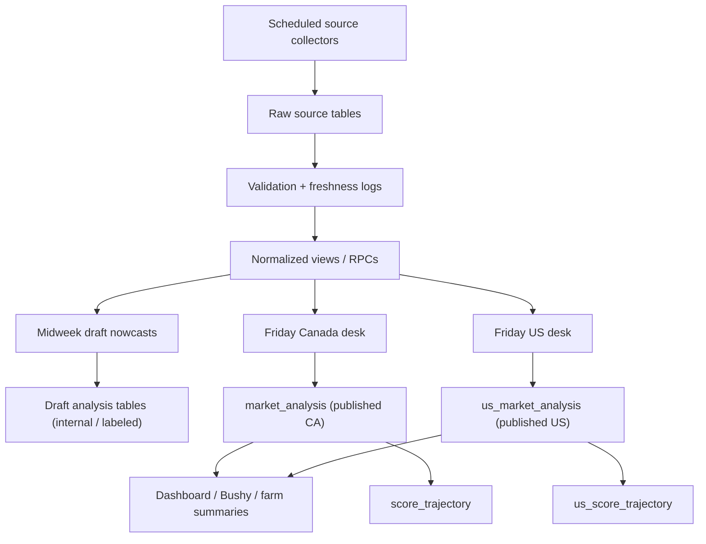
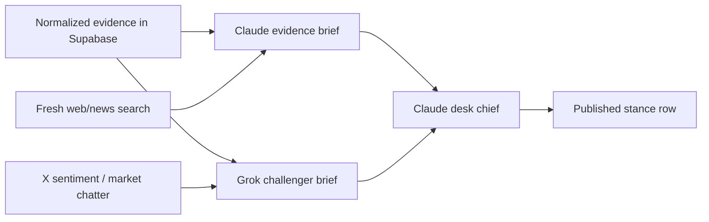

# Bushel Board Target-State Workflow Spec

**Date:** 2026-04-20
**Status:** Proposed
**Author:** Kyle + Codex
**Purpose:** Define the target operating model for Bushel Board as a Canada-first, evidence-driven grain market intelligence system with scheduled collectors, draft intraday updates, and Friday publish desks for Canada and the US.

---

## 1. Problem This Spec Solves

The current repo mixes multiple ideas:

- source collectors
- intraday thesis updates
- weekly publish
- Canada and US analysis
- Grok-only paths, Claude-only paths, and legacy dashboard contracts

That creates one recurring risk: the board can show a mixed state where the evidence, the draft thesis, and the published thesis are not clearly separated.

This spec defines the target state so the system behaves like a real grain desk:

1. dependable collectors bring in source data on schedule
2. fresh data creates draft nowcasts during the week
3. Friday desks publish the canonical weekly stance
4. the board reads published rows only unless a surface is explicitly marked as draft/live

---

## 2. Core Outcome

Bushel Board is a **futures-facing grain intelligence engine**.

It should answer:

- What changed in the market this week?
- Is that change bullish, bearish, or noise?
- How strong is the evidence?
- What is the canonical published stance for Canada?
- What is the canonical published stance for the US?
- What would invalidate the thesis next?

The product is not just a dashboard. It is an evidence store, debate system, and weekly publisher.

---

## 3. Core Principles

1. **Evidence first, opinion second.**
   Raw source data lands in Supabase before any model publishes a view.

2. **Collectors do not publish market opinion.**
   Collectors fetch, parse, validate, and log freshness only.

3. **Draft is not published.**
   Midweek updates are useful, but they must not overwrite the canonical Friday thesis.

4. **Canada and US are separate lanes.**
   They can share infrastructure and schemas, but they must publish to separate canonical tables.

5. **One publisher owns the final row.**
   Grok can challenge and enrich. Claude can resolve. Only one final actor writes the published thesis.

6. **The board reads published thesis by default.**
   If a surface wants live or draft analysis, it must label it clearly.

7. **Every thesis row must be auditable.**
   A farmer should be able to ask, "What data did this come from?" and the system should answer cleanly.

---

## 4. Target-State Mental Model



Short version:

`collect -> validate -> normalize -> draft during week -> publish on Friday -> display`

---

## 5. Target Layers

### Layer 0: Source Collection

Purpose:
- ingest dependable external releases
- write source-native rows
- record freshness and status

Collectors should be scheduled by source release cadence, not by UI needs.

### Layer 1: Validation and Freshness

Purpose:
- verify the import completed
- attach source date / grain week / shipping week / market year
- mark runs as `success`, `partial`, or `failed`

This is the anti-phantom layer. Failed collector runs are diagnostics, not user-facing state.

### Layer 2: Normalized Evidence

Purpose:
- combine raw data into canonical views and RPCs
- expose the math in one place

Examples:
- producer deliveries
- export pace
- stocks changes
- terminal flow
- producer car activity
- latest futures move
- peer sentiment

### Layer 3: Midweek Draft Nowcasts

Purpose:
- react when a new source lands
- update the internal desk view during the week
- never overwrite the published weekly anchor

This is the "what just changed?" lane.

### Layer 4: Friday Publish Desks

Purpose:
- freeze the evidence window
- run the full debate
- publish the canonical weekly stance

This is the "what do we stand behind?" lane.

### Layer 5: Product Consumption

Purpose:
- let the board, Bushy, and farm summaries read one coherent published thesis

Published rows are the truth. Draft rows are optional/internal unless explicitly surfaced.

---

## 6. Canada-First Lane

Canada starts first because the source releases are dependable and market timing is easier to automate.

### Initial Canada source set

| Source | Purpose | Current / target storage |
| --- | --- | --- |
| Canadian Grain Commission weekly stats | Core flow data: deliveries, exports, stocks, receipts | `cgc_observations` |
| GrainMonitor.ca | Terminal and logistics context | `grain_monitor_snapshots` |
| Producer cars | Rail car allocation / producer movement | `producer_car_allocations` |
| Grain traders / price quotes | Futures and local market pricing context | `grain_prices` and/or `posted_prices` |

### Canada cadence

- **Thursday:** CGC and Canada-side weekly logistics updates land
- **During week:** price and quote collectors can update daily
- **Friday:** Canada desk publishes the weekly canonical stance

### Canada output

- canonical publish table: `market_analysis`
- canonical score history: `score_trajectory`

---

## 7. US Lane

The US lane is a separate entity with the same discipline:

- separate collectors
- separate draft lane
- separate weekly desk
- separate canonical publish table

### Initial US source set

| Source | Purpose | Current / target storage |
| --- | --- | --- |
| USDA Export Sales | Export demand context | `usda_export_sales` |
| USDA WASDE | Monthly balance-sheet context | `usda_wasde_estimates` |
| USDA Crop Progress | Crop condition / planting / harvest context | `usda_crop_progress` |
| CFTC COT | Fund and commercial positioning | `cftc_cot_positions` |
| Futures prices | Tape confirmation | `grain_prices` |
| Reputable news + live market sentiment | Macro and market chatter | external retrieval + stored citations / signals |

### US output

- canonical publish table: `us_market_analysis`
- canonical score history: `us_score_trajectory`

### Rule

Canada and US can share presentation patterns, but a Canadian row must never masquerade as a US row or vice versa.

---

## 8. Debate Model

This is the target debate design implied by the product vision.

### Roles

| Role | Job | Strength |
| --- | --- | --- |
| Collectors | bring in fresh source data | deterministic, scheduled |
| Grok challenger | pull live X sentiment and market chatter, challenge complacent hard-data reads | speed, X-native context |
| Claude analyst | read structured evidence and reputable articles, frame the thesis conservatively | evidence discipline |
| Claude desk chief | resolve the debate and publish the canonical row | final accountability |

### Debate rule

Grok does **not** own the final published row.

Grok should do things Claude is weaker at:
- X sentiment
- live trade chatter
- "what the market is talking about right now"

Claude should do things that need tighter grounding:
- official data synthesis
- article/news confirmation
- contradiction resolution
- final publish decision

### Target flow



### Why this is the right split

- Grok is best used as a challenger, not a sole publisher
- Claude is best used as final resolver, not blind to live chatter
- one final writer avoids mixed authorship in the published table

---

## 9. Operating Modes

### Mode A: Collector Run

Trigger:
- scheduled by source release time

Writes:
- raw source rows
- collector status row
- freshness metadata

Does not write:
- published thesis

### Mode B: Draft Nowcast Run

Trigger:
- successful source collector run
- optionally throttled so multiple same-day drops coalesce

Writes:
- draft analysis rows only

Purpose:
- tell the internal desk what changed after each new release

### Mode C: Friday Publish Run

Trigger:
- scheduled after all expected weekly data has landed

Writes:
- canonical published row
- trajectory row
- downstream farm summary trigger

Purpose:
- create the official weekly stance the board stands behind

---

## 10. Canonical Publish Contract

The Friday desks should publish to these canonical tables only:

- Canada: `market_analysis`
- US: `us_market_analysis`

Each published row should include, at minimum:

- `grain` or `market_name`
- `crop_year` or `market_year`
- `grain_week` or market week anchor
- `stance_score`
- `confidence_score`
- `data_confidence`
- `initial_thesis`
- `bull_case`
- `bear_case`
- `bull_reasoning`
- `bear_reasoning`
- `final_assessment`
- `key_signals`
- `generated_at`
- `model_used`
- `data_freshness`
- source / citation metadata

### Invariant

The board should be able to render an entire bullish/bearish card from the canonical publish row alone.

That means the UI should not need to stitch hero copy from one table and stance logic from another.

---

## 11. Draft Contract

Target-state draft rows should live separately from canonical publish rows.

Recommended options:

1. new tables:
   - `market_analysis_drafts`
   - `us_market_analysis_drafts`

2. or one shared drafts table:
   - `analysis_drafts`

If a shared drafts table is used, it should include:

- `desk` (`ca` or `us`)
- `publish_state` (`draft`, `published`, `superseded`)
- `trigger_source`
- `run_id`
- `analysis_window`

### Rule

`market_analysis` and `us_market_analysis` are **published-only** target tables.

---

## 12. Recommended Run Metadata

To make this operable, target state should include unified run tracking.

### Collector metadata

Recommended table: `source_runs`

Fields:
- `source_name`
- `desk`
- `source_release_at`
- `collected_at`
- `status`
- `attempted_week`
- `effective_week`
- `row_count`
- `error_message`
- `freshness_payload`

### Analysis metadata

Use `pipeline_runs` for publish orchestration, but extend or pair it with:

- `run_type` (`collector`, `draft_nowcast`, `weekly_publish`)
- `desk` (`ca`, `us`)
- `publish_state`
- `trigger_sources`
- `frozen_evidence_at`

---

## 13. Product Read Rules

### Dashboard

- default read path: published tables only
- if a card shows draft/intraday material, it must be labeled

### Bushy chat

- default: answer from published rows plus evidence tables
- optionally mention fresher draft evidence if clearly labeled:
  - "published Friday stance is X"
  - "today's draft change is Y"

### Farm summaries

- weekly farm summaries should be generated from the published weekly anchor
- not from unreviewed midweek drafts

---

## 14. Failure and Guardrail Rules

### A collector fails

Outcome:
- raw source is stale
- the source run is red
- existing published thesis remains visible

The board should not invent a new published stance because a collector failed.

### A source is late

Outcome:
- draft lane may proceed with stale warning
- Friday desk can publish only if minimum evidence threshold is met

### Debate disagreement is wide

Outcome:
- Claude desk chief resolves explicitly
- final row records disagreement in metadata

### A publish row lacks structured bull/bear reasoning

Outcome:
- publish should be blocked or downgraded until the row satisfies the contract

---

## 15. Weekly Operating Rhythm

```text
Mon-Thu/Fri:
  collectors land source data
  -> validation/freshness update
  -> internal draft nowcast refresh

Friday afternoon:
  freeze the weekly evidence window

Friday evening:
  Canada desk publishes canonical CA row set
  US desk publishes canonical US row set
  -> score trajectory write
  -> farm summary trigger
  -> site health validation

Weekend:
  optional review / meta-audit of the week's calls
```

---

## 16. What Stays Legacy

These legacy concepts should not remain on the critical path in target state:

- using `grain_intelligence` as the primary source of truth for the board
- letting a single Grok pass publish the weekly canonical thesis
- mixing draft and published content in the same surface without labeling
- letting the grain page assemble one thesis from multiple tables

`grain_intelligence` can remain as:

- a legacy display cache
- a migration bridge
- an internal artifact

But it should not be the canonical weekly publish contract.

---

## 17. Recommended Implementation Order

### Phase 1: Canada weekly publish first

Ship first:
- stable Canada collectors
- unified freshness tracking
- Friday Canada desk
- `market_analysis` as published-only truth

### Phase 2: Separate draft from publish

Add:
- draft analysis table(s)
- run type separation
- explicit UI labeling for draft material

### Phase 3: Grok/Claude debate enforcement

Add:
- Grok challenger brief
- Claude analyst brief
- Claude desk chief publish step
- publish blockers for missing reasoning/citations

### Phase 4: US desk on the same contract

Ship:
- separate US collectors
- `us_market_analysis`
- `us_score_trajectory`
- same product read rules

### Phase 5: Prediction scoring

Once the publish contract is stable:
- compare weekly stance against subsequent price action
- score conviction, timing, and follow-through
- use that to tune the desk, not to overwrite history

---

## 18. Decision Summary

This is the target operating model:

- **Supabase is the evidence store**
- **collectors write facts**
- **midweek agents write drafts**
- **Friday desks write published thesis**
- **Grok challenges**
- **Claude resolves**
- **Canada and US publish separately**
- **the board reads published rows by default**

If the repo follows this spec, Bushel Board behaves like a real market desk instead of a dashboard with loosely attached AI.
