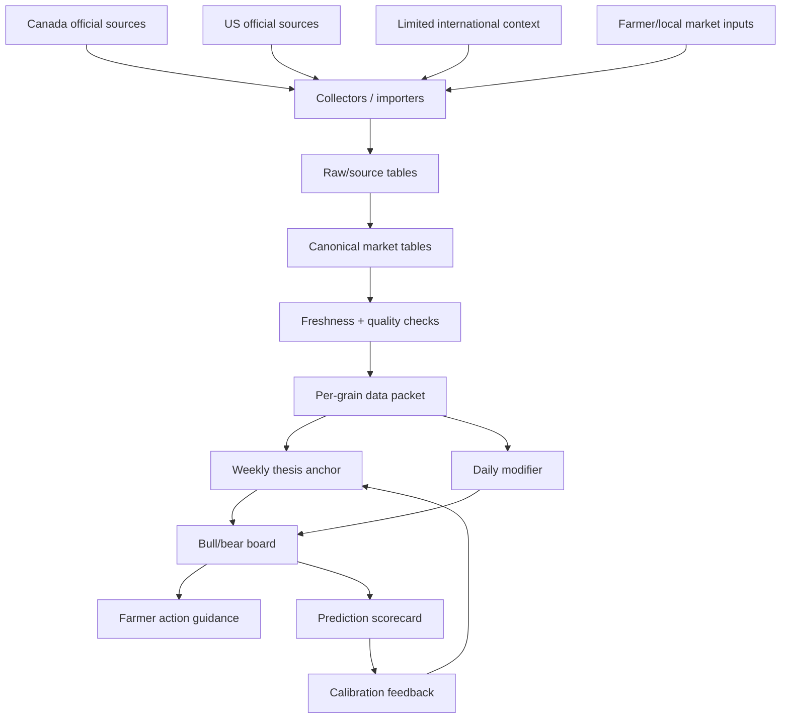

# Data Layer Foundation V1 Plan

Date: 2026-05-02

Goal: make Bushel Board's data layer strong enough to support a live grain thesis engine for Canada and the US, with limited international context added only where it directly affects the farmer-facing bull/bear call.

## TL;DR

Yes, the scope makes sense.

The correct v1 is not "collect everything." It is:

```text
trusted source data
  -> deterministic import
  -> canonical Supabase tables
  -> freshness and quality checks
  -> per-grain data packet
  -> weekly thesis anchor
  -> daily modifier
  -> prediction scorecard
```

Canada and the US should be first-class lanes. International markets should start as a bounded context lane using WASDE world balances, FAS export destinations, FX, and major global demand shocks. Do not add a broad FAO/AMIS/GAIN/AIS/satellite stack until the Canada/US data contracts are stable and the thesis layer is publishing cleanly.

## Product framing

Bushel Board is becoming a live grain thesis engine, not just a dashboard.

The data layer must answer five questions before the thesis layer gets involved:

1. What changed in physical supply?
2. What changed in demand and movement?
3. What changed in price, basis, or futures structure?
4. What changed in risk, weather, logistics, policy, or positioning?
5. Is the data fresh enough to trust for this week's farmer recommendation?

## V1 system map



## Live Supabase snapshot

Checked against the live Supabase project on 2026-05-02.

| Area | Table | Live state | Data-layer read |
| --- | --- | --- | --- |
| Canada weekly movement | `cgc_observations` | 1,133,610 rows; 2025-2026 latest is grain week 38, week ending 2026-04-26 | Strong. This is the current Canadian operational anchor. |
| CGC import ledger | `cgc_imports` | 32 runs; latest week 38 success with 4,313 rows inserted | Strong. Keep Codex importer as source refresh path. |
| Canada balance sheet | `supply_disposition` | 80 rows; latest source label `AAFC_2025-11-24` | Useful but stale-risk. Needs a repeatable AAFC/StatsCan update routine. |
| US crop progress | `usda_crop_progress` | 507 rows; latest week ending 2026-04-26 | Strong enough for US crop-condition/progress context. |
| US export sales | `usda_export_sales` | 232 rows; latest week ending 2026-04-16 | Useful but likely behind. Needs freshness audit and routine hardening. |
| WASDE/PSD | `usda_wasde_raw` / `usda_wasde_mapped` | 1,981 raw rows; 150 mapped rows; April 2026 present | Strong conceptually. Needs one agreed latest-vs-archive contract. |
| CFTC positioning | `cftc_cot_positions` | 548 rows; latest observed report date 2026-04-21 | Useful but should be checked against current CFTC release cadence. |
| Futures prices | `grain_prices` | 331 rows; latest sampled prices around 2026-04-24 to 2026-04-26 | Useful but not yet a true daily market tape. |
| Grain Monitor | `grain_monitor_snapshots` | 31 rows; latest grain week 37 | Useful for Canadian logistics, naturally lagged. |
| Producer cars | `producer_car_allocations` | 342 rows; latest grain week 39 | Strong forward-looking logistics context. |
| Weather | `weather_cache` | 0 rows | Empty. Do not rely on it yet. |
| Local/cash prices | `posted_prices` | 0 rows | Empty. This is a major farmer-value gap. |
| X signals | `x_market_signals` | 1,047 rows; latest created around week 37; mixed `x`/`web` source | Keep as archive. Rebuild direct X API v2 lane later. |
| Canadian thesis | `market_analysis` | Latest Canada rows are grain week 36 | Thesis layer is stale relative to source data. |
| US thesis | `us_market_analysis` | 5 rows, all Grok-written | Treat as legacy until Claude/Codex US thesis writer replaces it. |
| Evaluation | `prediction_scorecard` | 72 rows, many unresolved | Good skeleton, but needs fresher price/cash data to become useful. |

## Source catalog

### Tier 1 - must be solid before thesis v1

| Source | Country/lane | Purpose | Current status | Action |
| --- | --- | --- | --- | --- |
| CGC Grain Statistics Weekly | Canada | Weekly producer deliveries, terminal receipts, exports, stocks, process flows | Live and current to week 38 | Keep Codex Thursday routine active. |
| CGC Producer Cars | Canada | Forward-looking producer car allocation and destination pressure | Live to week 39 | Keep as logistics signal; tie into source freshness ledger. |
| Grain Monitor | Canada | Country/terminal stocks, capacity, unloads, vessel pressure | Live to week 37 | Keep as logistics signal; document expected lag. |
| AAFC / Statistics Canada supply-disposition | Canada | Production, carry-in, total supply, exports, domestic use, carry-out | Stored, but update process is not strong enough | Build monthly/periodic update routine. |
| USDA NASS Crop Progress / Quick Stats | US | Planting, emergence, harvest, conditions, state/national progress | Live to 2026-04-26 | Keep canonical row shape and guard against raw-row drift. |
| USDA FAS Export Sales | US/global demand | Weekly net sales, exports, outstanding sales, buyer/destination signal | Present but needs freshness audit | Harden routine and make freshness visible. |
| USDA WASDE / FAS PSD | US/world | Supply, demand, ending stocks, stocks-to-use, global balance sheet | Present | Finish latest-vs-archive contract and revision history. |
| CFTC COT | US futures positioning | Managed money and commercial positioning | Present | Verify current report freshness weekly. |
| Futures prices | Cross-border | Price follow-through and prediction evaluation | Present but thin | Turn into reliable daily feed. |

### Tier 2 - farmer value, after Tier 1 is stable

| Source | Purpose | Why it matters | Action |
| --- | --- | --- | --- |
| Local cash bids / posted prices | Farmer-level marketing relevance | Futures are not the farmer's cheque. Cash/basis is where advice becomes real. | Build minimal local cash/basis input first, API later. |
| Farmer inventory and delivery input | Peer comparison and market behavior | My Farm flywheel; anonymized cross-farm comparison is high-value. | Keep the input surface simple; enforce privacy thresholds. |
| Weather observations/forecasts | Production risk and seeding/harvest risk | Needed for daily modifiers, especially during planting and fill. | Start with limited Canada/US prairie/grain-belt stations. |
| FX | CAD/USD conversion and export competitiveness | Required for Canada vs US price comparison. | Wire into price context, not thesis prose only. |
| Kalshi markets | Prediction validation | Useful for testing whether thesis direction agrees with prediction markets. | Keep in validation layer, not as a source-of-truth input yet. |

### Tier 3 - explicitly not now

Do not add these until the Canada/US data packet and thesis writer are stable:

| Source class | Why not v1 |
| --- | --- |
| Full FAO/AMIS global dashboards | Too broad; can create noise before the core thesis is calibrated. |
| GAIN report firehose | Valuable, but document-heavy and easy to over-interpret without a classifier. |
| AIS/vessel-tracking/freight APIs | Expensive and complex; only worth it after logistics value is proven. |
| Global satellite crop models | Genuine upgrade later, but high integration cost and calibration burden. |
| Hermes orchestration | Accessory armor for now. Useful only after data/thesis contracts are stable. |

## Canonical data contracts

### 1. Source run ledger

Create a universal source run table before adding more collectors.

Suggested table: `source_runs`

Required fields:

```text
id
source_name
source_lane
collector_name
status
source_period_start
source_period_end
latest_source_label
rows_inserted
rows_updated
rows_skipped
error_message
source_url
started_at
finished_at
metadata jsonb
```

Why this matters: the thesis writer should never need to guess whether data is current. It should read a freshness summary.

### 2. Grain/market mapping registry

Create one mapping table instead of scattering source commodity mappings across scripts.

Suggested table: `grain_market_mappings`

Required fields:

```text
canonical_grain
market_lane
source_name
source_commodity
source_class
source_region
mapping_type
mapping_confidence
notes
```

Rule: proxy mappings are allowed, but must be labeled. Example: US soybeans can be context for Canadian canola, but it must not be stored as if it were Canadian canola source truth.

### 3. Data freshness view

Create one thesis-facing view/RPC:

```text
get_thesis_data_freshness(grain, lane)
```

It should return:

```text
source_name
latest_period
expected_cadence
freshness_status
last_success_at
last_error
```

The board can use this to show whether a thesis is built on current source data or stale source data.

### 4. Thesis data packet

Before building the thesis layer, define the exact data packet each grain receives.

Suggested RPCs:

```text
get_canada_thesis_packet(grain, crop_year, grain_week)
get_us_thesis_packet(market_name, market_year)
get_cross_border_context(grain)
```

Each packet should return structured facts only:

```text
supply
demand
logistics
prices
positioning
weather
farmer_behavior
international_context
freshness
quality_warnings
```

Rule: this packet contains facts and derived metrics, not AI conclusions.

## Build order

### Phase 0 - inventory and lock the plan

Status: this plan.

Deliverables:

- Source catalog written.
- Live Supabase gaps recorded.
- Canada/US first-class lanes confirmed.
- International scope capped for v1.

### Phase 1 - source freshness ledger

Deliverables:

- Add `source_runs`.
- Update existing importers to write run summaries:
  - CGC
  - USDA crop progress
  - USDA export sales
  - WASDE
  - CFTC
  - Grain Monitor
  - Producer cars
  - prices
- Add freshness query/view for thesis and UI.

Done when:

- One query can say which sources are current, stale, failed, or unavailable.
- The app no longer relies on human memory to know whether a source ran.

### Phase 2 - Canada source hardening

Deliverables:

- Keep CGC weekly importer current.
- Add or repair AAFC/StatsCan supply-disposition update routine.
- Confirm Grain Monitor expected lag and producer car forward-week behavior.
- Add first local cash/basis plan:
  - manual entry first
  - source/company/API later
- Add Canada weather baseline only after source ledger exists.

Done when:

- Canadian thesis packet can explain supply, movement, logistics, price, and freshness per grain without reading old Grok archives.

### Phase 3 - US source hardening

Deliverables:

- Fix USDA export sales freshness.
- Keep crop progress canonical, not raw QuickStats rows.
- Complete WASDE latest + archive revision-history contract.
- Confirm CFTC latest report freshness.
- Turn US futures prices into a daily reliable feed.
- Add USDA acreage/plantings/stocks where it improves seasonal context.

Done when:

- US wheat, corn, soybeans, oats, and barley have a complete enough data packet for a Claude/Codex thesis writer.

### Phase 4 - limited international context

Deliverables:

- WASDE world balances by commodity.
- FAS export destination/buyer context.
- FX context for CAD/USD.
- Optional one-row risk flags for major policy/geopolitical shocks.

Explicitly deferred:

- FAO/AMIS data expansion.
- GAIN report classifier.
- AIS/freight feeds.
- global satellite crop condition models.

Done when:

- International context can modify a thesis, but cannot overwhelm the Canada/US source truth.

### Phase 5 - thesis packet contract freeze

Deliverables:

- `get_canada_thesis_packet()`
- `get_us_thesis_packet()`
- `get_cross_border_context()`
- tests or validation queries for each source block
- docs showing exact source-to-packet mapping

Done when:

- The thesis layer can be rebuilt without touching source importers.
- Claude/Codex agents receive the same structured fact packet every run.

## Priority backlog

### P0 - do before thesis-layer rebuild

1. Add `source_runs`.
2. Add `grain_market_mappings`.
3. Add `get_thesis_data_freshness()`.
4. Harden USDA export sales freshness.
5. Verify CFTC and price freshness.
6. Build Canada/US thesis packet contracts.
7. Mark `us_market_analysis` Grok rows as legacy in docs/UI before using the US board for decisions.

### P1 - do next

1. Build AAFC/StatsCan supply-disposition update routine.
2. Add local cash/basis v1.
3. Add weather baseline only for active growing regions.
4. Wire prediction scorecard to fresh price data.
5. Make source freshness visible on the board.

### P2 - defer

1. X API v2 signal reboot.
2. Kalshi validation layer.
3. GAIN report classifier.
4. FAO/AMIS.
5. Hermes.
6. global satellite crop models.

## Source references

- Canadian Grain Commission statistics overview: <https://www.grainscanada.gc.ca/en/grain-research/statistics/index.html>
- Statistics Canada supply and disposition program: <https://www23.statcan.gc.ca/imdb/p2SV.pl?Function=getSurvey&Id=1570305>
- USDA NASS developer/API page: <https://www.nass.usda.gov/developer/>
- USDA Crop Progress ESMIS publication: <https://esmis.nal.usda.gov/publication/crop-progress>
- USDA FAS export sales page: <https://apps.fas.usda.gov/export-sales/>
- USDA WASDE report page: <https://www.usda.gov/about-usda/general-information/staff-offices/office-chief-economist/commodity-markets/wasde-report>
- USDA historical WASDE data: <https://www.usda.gov/historical-wasde-report-data-3>
- CFTC Commitments of Traders: <https://www.cftc.gov/MarketReports/CommitmentsofTraders/index.htm>
