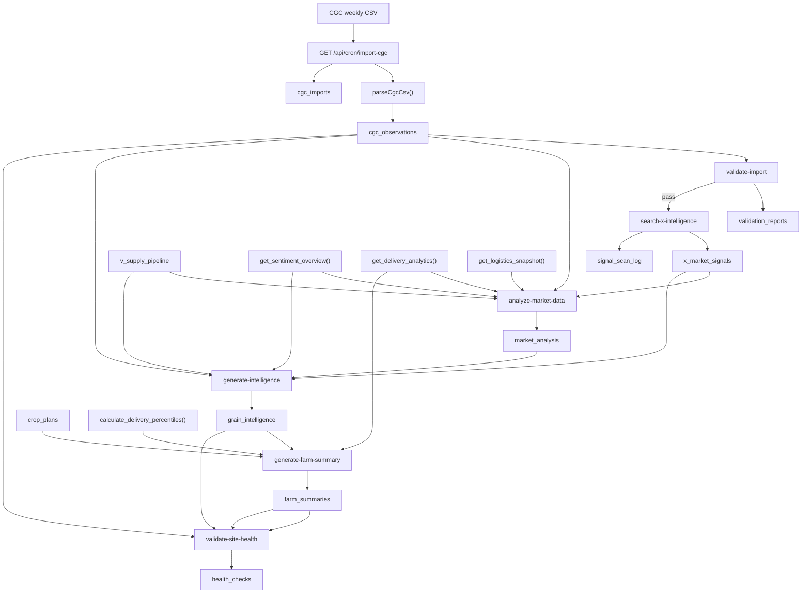
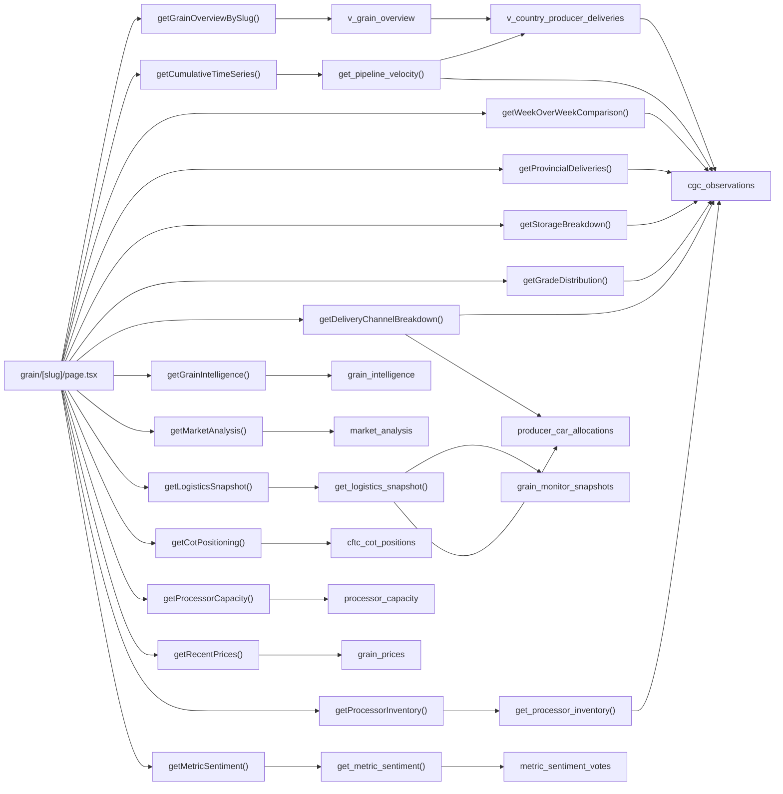
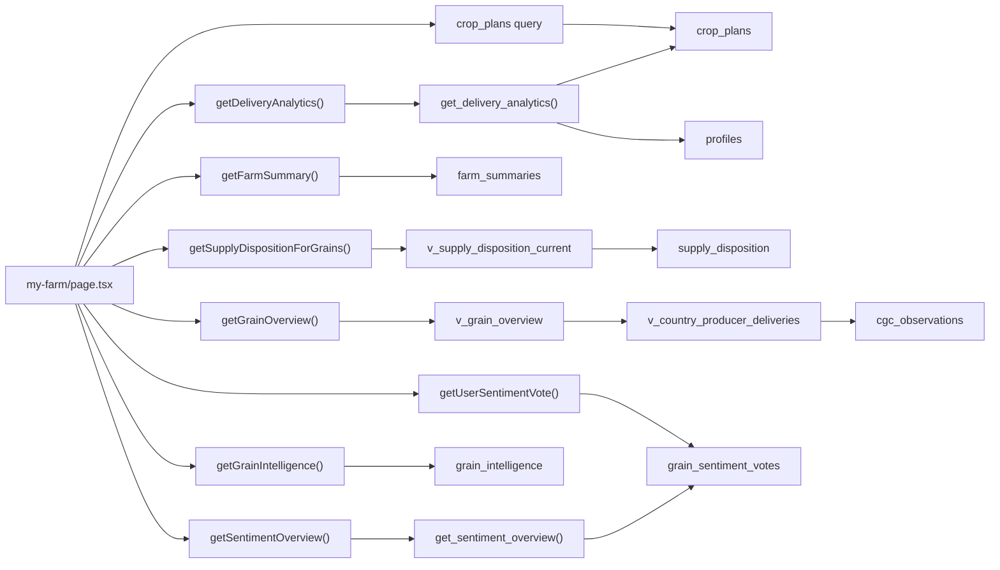
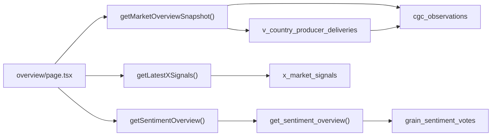

# Bushel Board Data Lineage Map

This is the closest thing to an org chart for the product.

Better term: a data lineage map. Data lineage means "where a number starts, how it gets transformed, and where it ends up in the UI."

## Core Mental Model

Most dashboard numbers come from one of these root sources:

1. `cgc_observations` for Canadian Grain Commission weekly grain data.
2. `supply_disposition` and `v_supply_disposition_current` for AAFC-style balance sheet data.
3. `x_market_signals` for Grok-scored X and web signals.
4. `grain_sentiment_votes` and `metric_sentiment_votes` for farmer voting.
5. `crop_plans` and `crop_plan_deliveries` for farmer-specific data.
6. `grain_monitor_snapshots` and `producer_car_allocations` for logistics context.

The main pattern is:

`source -> raw table -> SQL view/RPC -> lib/queries/* -> page.tsx -> component card`

## 1. Weekly Production Chain

## 2. Grain Detail Page Call Map

File: `app/(dashboard)/grain/[slug]/page.tsx`

## 3. My Farm Page Call Map

File: `app/(dashboard)/my-farm/page.tsx`

## 4. Overview Page Call Map

File: `app/(dashboard)/overview/page.tsx`

## 5. Data Point Lineage Table

| UI data point | Query function | SQL object | Base source |
| --- | --- | --- | --- |
| Overview producer deliveries | `getMarketOverviewSnapshot()` | `v_country_producer_deliveries` | `cgc_observations` |
| Overview terminal receipts | `getMarketOverviewSnapshot()` | direct aggregation | `cgc_observations` |
| Overview exports | `getMarketOverviewSnapshot()` | direct aggregation | `cgc_observations` |
| Overview commercial stocks | `getMarketOverviewSnapshot()` | direct aggregation | `cgc_observations` |
| Grain hero thesis | `getGrainIntelligence()` | direct table read | `grain_intelligence` |
| Grain bull/bear cards | `getMarketAnalysis()` | direct table read | `market_analysis` |
| Grain key metrics row | `getWeekOverWeekComparison()` | in-code composite math | `cgc_observations` |
| Grain net balance chart | `getCumulativeTimeSeries()` | `get_pipeline_velocity()` | `v_country_producer_deliveries` + `cgc_observations` |
| Grain delivery breakdown chart | `getDeliveryChannelBreakdown()` | direct query mix | `cgc_observations` + `producer_car_allocations` |
| Grain province map | `getProvincialDeliveries()` | direct query | `cgc_observations` |
| Grain storage breakdown | `getStorageBreakdown()` | direct query | `cgc_observations` |
| Grain grade donut | `getGradeDistribution()` | direct query | `cgc_observations` |
| Grain logistics card | `getLogisticsSnapshot()` | `get_logistics_snapshot()` | `grain_monitor_snapshots` + `producer_car_allocations` |
| Grain COT card | `getCotPositioning()` | direct table read | `cftc_cot_positions` |
| Grain processor inventory | `getProcessorInventory()` | `get_processor_inventory()` | `cgc_observations` |
| Grain price sparkline | `getRecentPrices()` | direct table read | `grain_prices` |
| Grain metric voting badges | `getMetricSentiment()` | `get_metric_sentiment()` | `metric_sentiment_votes` |
| My Farm weekly summary | `getFarmSummary()` | direct table read | `farm_summaries` |
| My Farm delivery pace | `getDeliveryAnalytics()` | `get_delivery_analytics()` | `crop_plans` |
| My Farm percentiles | `generate-farm-summary` | `calculate_delivery_percentiles()` | `crop_plans` |
| My Farm recommendations | derived in page code | mixed | `grain_intelligence` + `v_supply_disposition_current` + `v_grain_overview` + `crop_plans` |
| Overview community pulse | `getSentimentOverview()` | `get_sentiment_overview()` | `grain_sentiment_votes` |
| Overview signal strip | `getLatestXSignals()` | direct table read | `x_market_signals` |

## 6. Most Important Formulas

These are the numbers most likely to cause confusion.

### Producer Deliveries

Canonical formula:

`Primary.Deliveries (AB/SK/MB/BC, grade='') + Process.Producer Deliveries (grade='') + Producer Cars.Shipments (AB/SK/MB, grade='')`

Main SQL object:

`v_country_producer_deliveries`

### Exports

Canonical formula:

`Terminal Exports + Primary Shipment Distribution where region='Export Destinations' + Producer Cars Shipment Distribution where region='Export'`

This is why "Exports" is not just one worksheet.

### Pipeline Velocity

Main SQL object:

`get_pipeline_velocity()`

It combines:

1. producer deliveries from `v_country_producer_deliveries`
2. terminal receipts from `Terminal Receipts`
3. exports from the full exports formula above
4. processing from `Process.Milled/Mfg Grain`

Then `lib/queries/observations.ts` forward-fills missing cumulative weeks so a lagging worksheet does not incorrectly look like zero.

### Grain Intelligence

The final intelligence shown to farmers is not generated directly from the CGC import.

It is:

`cgc_observations + v_supply_pipeline + sentiment RPC + logistics RPC + x_market_signals + market_analysis -> grain_intelligence`

### Farm Summary

The farmer summary is a separate personalized layer:

`crop_plans + delivery percentiles + community analytics + X search context -> farm_summaries`

## 7. How To Read The System Quickly

If you want to trace any card:

1. Start at the page file.
2. Find the `get...()` query function called by that page.
3. Check whether that query uses a direct table read, a SQL view, or an RPC.
4. If it uses a view or RPC, trace that object back to its source tables.

The practical shortcut is:

`page.tsx -> lib/queries/* -> view/RPC -> base table`

## 8. Best Next Step

If you want this to become easier to maintain, the clean next move is a live internal `/system-map` page that renders these diagrams and links each card to its query function and SQL object.

Why this is better than a static org chart:

1. it stays close to the code
2. it is easier to update after each schema change
3. it reduces the chance that documentation drifts away from reality
